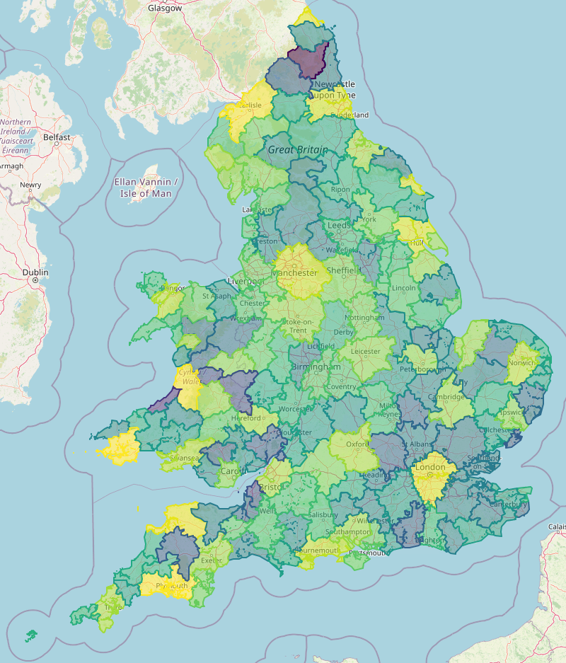

## Travel to work area algorithm in Rust

This crate aims to replicate the travel to work area algorithm used by the ONS to identifying labour market areas in the UK using commute matrices from the census.
The methodology is explained in detail [here](https://www.ncl.ac.uk/media/wwwnclacuk/curds/files/TTWA%20report.pdf). This is for the most part a carbon copy of the metholodogy, but there are some points that are left unclear -- like which of the two provided definitions of self-containment are used in the 'X' equation that determines which proto-TTWA to eliminate next.

## Usage

The code takes a CSV where rows represent origin locations and columns represent destination locations. The value at row i, column j is the number of people who live in area i and community to area j.
You need to have Rust and cargo installed to run it, but you can do so simply by typing

```bash
cargo run --release path/to/your/file.csv [path/to/result/file.csv] [maximum_iterations]
```

This will create a new CSV with the specified file name where each row contains a location and the TTWA it belongs to, represented by an integer ranging from 0 to the number of TTWAs - 1.

The ONS has provided travel to work matrices based on the 2021 England and Wales Census that can be used with this program [here](https://www.ons.gov.uk/releases/estimationoftraveltoworkmatricesenglandandwales).

## Map of TTWAs

Below is a map of the TTWAs identified by the algorithm for the ONS travel to work matrices from the 2021 England and Wales census (using estimated pre-coronavirus travel patterns). The colors indicate the supply-side self-containment (yellow is high, blue is low). TTWAs that people tend to commute to have higher self-containment and TTWAs that people tend to commute from have lower self-containment.

