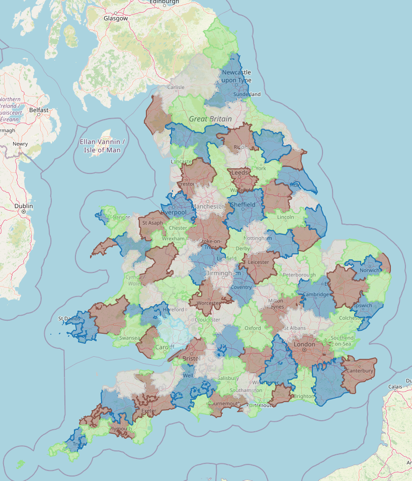

## Travel to work area algorithm in Rust

This crate aims to replicate the travel to work area algorithm used by the ONS to identifying labour market areas in the UK using commute matrices from the census.
The methodology is explained in detail [here](https://www.ncl.ac.uk/media/wwwnclacuk/curds/files/TTWA%20report.pdf). This is a carbon copy of the methodology as best as I understand it. There is one main source of ambiguity, which is how the indifference curve presented for the x-equation is used to produce a ranking (vs. a simple pass/fail score). I have produced a utility function that has the same indifference curve where utility is equal to 0 (the threshold for when to stop the algorithm), but it may not reflect exactly how the original methodology works.

## Usage

The code takes a CSV where rows represent origin locations and columns represent destination locations. The value at row i, column j is the number of people who live in area i and community to area j.
You need to have Rust and cargo installed to run it, but you can do so simply by typing

```bash
cargo run --release path/to/your/file.csv [path/to/result/file.csv] [maximum_iterations]
```

This will create a new CSV with the specified file name where each row contains a location and the TTWA it belongs to, represented by an integer ranging from 0 to the number of TTWAs - 1.

The ONS has provided travel to work matrices based on the 2021 England and Wales Census that can be used with this script [here](https://www.ons.gov.uk/releases/estimationoftraveltoworkmatricesenglandandwales).

## Map of TTWAs

Below is a map of the TTWAs identified by the algorithm for the ONS travel to work matrices from the 2021 England and Wales census (using estimated pre-coronavirus travel patterns).


